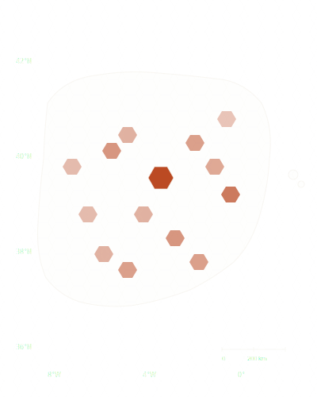

```{=html}
<div class="home">

<!-- ========== HERO ========== -->
<section class="hero">
  <div class="hex-bg" aria-hidden="true">
    <svg viewBox="0 0 1400 900" xmlns="http://www.w3.org/2000/svg" preserveAspectRatio="xMidYMid slice">
      <defs>
        <pattern id="hexpat" width="60" height="52" patternUnits="userSpaceOnUse">
          <polygon points="15,0 45,0 60,26 45,52 15,52 0,26" fill="none" stroke="#19150f" stroke-width="0.8"/>
        </pattern>
      </defs>
      <rect width="100%" height="100%" fill="url(#hexpat)"/>
      <polygon points="375,260 405,260 420,286 405,312 375,312 360,286" fill="#b8421a" class="hex-active"/>
      <polygon points="555,468 585,468 600,494 585,520 555,520 540,494" fill="#b8421a" opacity="0.6"/>
      <polygon points="975,156 1005,156 1020,182 1005,208 975,208 960,182" fill="#b8421a" opacity="0.4"/>
      <polygon points="855,624 885,624 900,650 885,676 855,676 840,650" fill="#19150f" opacity="0.5"/>
    </svg>
  </div>

  <div class="hero-top">
    <div class="eyebrow reveal d1">Geospatial Analytics · Building in Public</div>
    <div class="coords reveal d1">
      <div>LAT <span>40°25′ N</span></div>
      <div>LON <span>3°42′ W</span></div>
    </div>
  </div>

  <div class="hero-main">
    <div class="hero-title reveal d2" role="heading" aria-level="1">
      Geospatial analytics,<br>
      <em>indexed to the cell<span class="accent-dot">.</span></em>
    </div>
  </div>

  <div class="hero-sub">
    <p class="reveal d3">A geospatial practice in the making — built in public over six months. The first project, mapping <em>where Spain actually lives</em>, ships May 26, 2026.</p>
    <div class="pillpair reveal d4">
      <span class="pill">H3</span>
      <span class="pill">GeoParquet</span>
      <span class="pill">Apache Sedona</span>
      <span class="pill">Databricks</span>
    </div>
  </div>
</section>

<!-- ========== STATUS STRIP ========== -->
<div class="status-strip reveal d5">
  <div class="stat"><span class="val">Week 5</span> of 26</div>
  <div class="stat"><span class="val">Block 1</span> curriculum cleared</div>
  <div class="stat"><span class="val">May 26</span> first project ships</div>
  <div class="stat"><span class="val">5</span> Spain projects planned</div>
</div>

<!-- ========== MANIFESTO ========== -->
<section class="manifesto">
  <p>Every business problem has a location. <span class="strong">Most companies leave that signal on the floor.</span> We pick it up, give it an address, and put it to work.</p>
</section>

<!-- ========== FEATURED PROJECT (P-01) ========== -->
<section class="feature">
  <div class="case">
    <div class="case-visual">
      <div class="corner tl"></div>
      <div class="corner tr"></div>
      <div class="corner bl"></div>
      <div class="corner br"></div>
      <div class="meta">
        <div>Project / <span>P-01</span></div>
        <div>Resolution / <span>H3 r9</span></div>
      </div>
      

    </div>

    <div class="case-body">
      <div class="case-tag">P-01 · Ships May 26</div>
      <h2>Where does Spain <em>actually</em> live?</h2>
      <p>The opening project bins Spain's population into H3 cells from the <em>INE Padrón</em>, then cross-checks the result against NASA's Black Marble night-lights — a test of where people really are, not just where the registry lists them.</p>
      <p>It's the first chapter of a three-part series on Spain's demographic and housing story.</p>
      <div class="case-sources">
        <div><h4>Population</h4><div class="src">INE Padrón</div></div>
        <div><h4>Index</h4><div class="src">H3 · r9</div></div>
        <div><h4>Validation</h4><div class="src">Black Marble</div></div>
      </div>
      <p class="proj-more"><a href="projects/p-01-spain-population.qmd">Read the build →</a></p>
    </div>
  </div>
</section>

<!-- ========== PROJECT PREVIEW TILES ========== -->
<section class="home-projects" id="projects">
  <div class="section-label"><span>Projects</span> — Spain's demographic trilogy</div>
  <div class="proj-grid">

    <a class="proj-tile" href="projects/p-01-spain-population.qmd">
      <div class="proj-head">
        <span class="proj-code">P-01</span>
        <span class="proj-status live">Ships May 26</span>
      </div>
      <h3 class="proj-title">Where does Spain actually live?</h3>
      <p class="proj-sub">Population density per H3 cell, cross-validated against NASA Black Marble night-lights.</p>
      <span class="proj-arrow">Read the build →</span>
    </a>

    <a class="proj-tile" href="projects/p-02-migration.qmd">
      <div class="proj-head">
        <span class="proj-code">P-02</span>
        <span class="proj-status">Queued</span>
      </div>
      <h3 class="proj-title">The 2020–2024 reshuffling</h3>
      <p class="proj-sub">Internal migration flows across Spain, traced year over year.</p>
      <span class="proj-arrow">Coming soon →</span>
    </a>

    <a class="proj-tile" href="projects/p-03-housing-pressure.qmd">
      <div class="proj-head">
        <span class="proj-code">P-03</span>
        <span class="proj-status">Queued</span>
      </div>
      <h3 class="proj-title">Where Spain grew but didn't build</h3>
      <p class="proj-sub">Housing pressure where migration meets prices and the pace of construction.</p>
      <span class="proj-arrow">Coming soon →</span>
    </a>

  </div>
  <p class="proj-more">See all five projects → <a href="projects/index.qmd">Projects</a></p>
</section>

<!-- ========== WRITING ========== -->
<section class="home-writing" id="writing">
  <div class="section-label"><span>Writing</span> — notes from the build</div>
  <p class="lead">Essays on the methods behind each project — the indexing schemes, the data sources, the trade-offs worth arguing about. The first pieces ship alongside P-01.</p>
  <div class="writing-list">
    <div class="writing-row">
      <span class="wt">H3 as integer hashing</span>
      <span class="ws">Soon</span>
    </div>
    <div class="writing-row">
      <span class="wt">The H3 resolution trade-off</span>
      <span class="ws">Soon</span>
    </div>
  </div>
</section>

<!-- ========== ABOUT ========== -->
<section class="home-about" id="about">
  <div class="section-label"><span>About</span> — what Prospectra is</div>
  <p>Prospectra is a geospatial analytics practice, built in public. Spain has a gap: the traditional GIS shops don't run on the lakehouse, and the big Databricks consultancies don't do geospatial. Prospectra is being built to live in that intersection — <span class="about-accent">Databricks-native spatial pipelines on Spain's open data</span>.</p>
  <p>Right now it's week 5 of a six-month sprint: twenty lessons, five portfolio projects, each shipping as a public article. Block 1 of the curriculum is cleared; the first project ships May 26. This site is the stage where the work goes public.</p>
</section>

</div>
```
